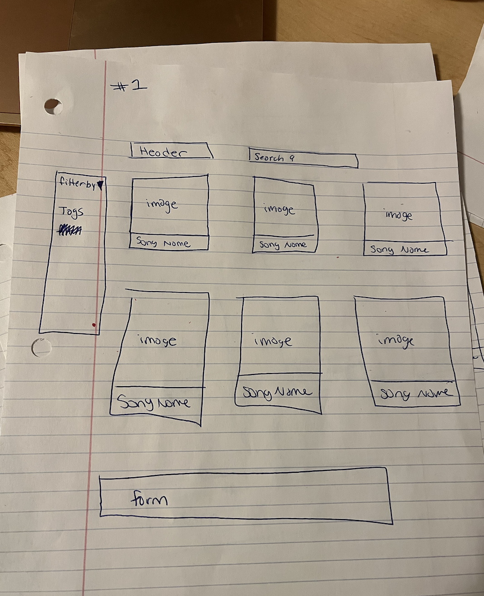
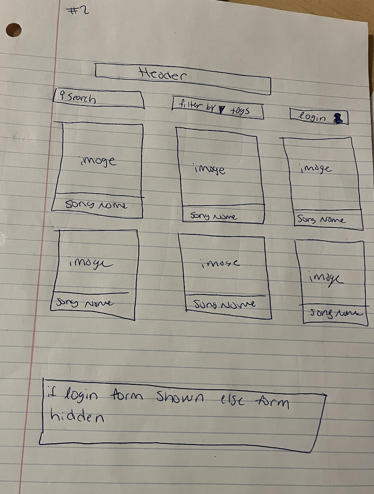

# Project 3: Design Journey

**For each milestone, complete only the sections that are labeled with that milestone.** Refine all sections before the final submission.

You are graded on your design process. If you later need to update your plan, **do not delete the original plan, rather leave it in place and append your new plan _below_ the original.** Then explain why you are changing your plan. Any time you update your plan, you're documenting your design process!

**Replace ALL _TODOs_ with your work.** (There should be no TODOs in the final submission.)

Be clear and concise in your writing. Bullets points are encouraged.

**Everything, including images, must be visible in _Markdown: Open Preview_.** If it's not visible in the Markdown preview, then we can't grade it. We also can't give you partial credit either. **Please make sure your design journey should is easy to read for the grader;** in Markdown preview the question _and_ answer should have a blank line between them.


## Design Plan (Milestone 1)

**Make the case for your decisions using concepts from class, as well as other design principles, theories, examples, and cases from outside of class (includes the design prerequisite for this course).**

You can use bullet points and lists, or full paragraphs, or a combo, whichever is appropriate. The writing should be solid draft quality.


### Catalog (Milestone 1)
> What will your catalog website be about? (1 sentence)

Tyler, the Creator music catalog

### _Consumer_ Audience (Milestone 1)
> Briefly explain your site's _consumer_ audience. Your audience should be specific, but not arbitrarily specific. (1 sentence)
> Justify why this audience is a **cohesive** group. (1-2 sentences)

The audience of this website would be fans of Tyler, the Creator.

This is a cohesive audience because they are all a part of his fan base and are interested in exploring and accessing his musical catalog.

### _Consumer_ Audience Goals (Milestone 1)
> Document your _consumer_ audience's goals for using this catalog website.
> List each goal below. There is no specific number of goals required for this, but you need enough to do the job (Hint: It's more than 1. But probably not more than 3.)
> **Hint:** Users will be able to view all entries in the catalog and insert new entries into the catalog. The audience's goals should probably relate to these activities.

Goal 1: Find other songs similar to the Tyler, the creator songs what they currently enjoy

- **Design Ideas and Choices** _How will you meet those goals in your design?_
  - Have a filter or sorting option.

- **Rationale & Additional Notes** _Justify your decisions; additional notes._
  - Having this option allows for users to filter for songs based on their needs and interests and the corresponding tags associated with each entry.

Goal 2: Find songs that they are specifically looking for

- **Design Ideas and Choices** _How will you meet those goals in your design?_
  - Have a search bar.

- **Rationale & Additional Notes** _Justify your decisions; additional notes._
  - The search bar allows for users to find exactly what they are looking for, just by matching the name of what they are lookign for and the name of the entry.

Goal 3: Identify which songs are on the same album/project
- **Design Ideas and Choices** _How will you meet those goals in your design?_
  - Each song will be accompanied by the respective cover art

- **Rationale & Additional Notes** _Justify your decisions; additional notes._
  - Users would be able to better find the songs they are looking and connect them together when there is an accompanying visual.

### _Consumer_ Audience Device (Milestone 1)
> How will your _consumer_ audience access this website? From a narrow (phone) or wide (laptop) device?
> Justify your decision. (1 sentence)

Wide laptop device

This device makes the most sense because there is a lot of information and accompanying features that the user would be able to access more efficiently on a wider screen.

### _Consumer_ Persona (Milestone 1)
> Use the goals you identified above to develop a persona of your site's _consumer_ audience.
> Your persona must have a name and a face. The face can be a photo of a face or a drawing, etc.


<!--- Source: adobe.com -->

Jasper Brown

Jasper Brown is a 16 year old high school boy who recently discovered Tyler,the creator after hearing one of his song's at his friend's birthday party. After hearing that song, Jasper went to the internet to find other songs in Tyler's catelog that he might enjoy as well.

**Factors that Influence Behavior:**

  - What Jasper's friends like/ what his peers think is cool
  - The type of music Jasper grew up around/was exposed to in his household, from external family members, friends

**Goals:**

- Find the project associated to the song that he currently likes
- Search for more of Tyler's music similar to the song that he currently likes

**Obstacles:**

- Internet and music restrictions placed on him by his parents
- He does not know much about Tyler, the creator and may not know where to start in finding other songs he may enjoy.

**Desires:**
- Find out more information about Tyler, the creator's music catelog
- Get more familiar with his albums and projects
- Find other songs of Tyler's that he likes as well

### _Administrator_ Audience (Milestone 1)
> Briefly explain your site's _administrator_ audience. Your audience should be specific, but not arbitrarily specific. (1 sentence)
> Justify why this audience is a **cohesive** group. (1-2 sentences)

The administrator audience refers to those who are very knowledgeable on Tyler/ may have inside information that the regular fan would not have access to.

This is a cohesive audience because they have enough information on Tyler and/or the music industry to create a new entry.

### _Administrator_ Audience Goals (Milestone 1)
> Document your _administrator_ audience's goals for using this catalog website.
> List each goal below. There is no specific number of goals required for this, but you need enough to do the job (Hint: It's more than 1. But probably not more than 3.)
> **Hint:** Users will be able to view all entries in the catalog and insert new entries into the catalog. The audience's goals should probably relate to these activities.

Goal 1: Be able to add new entries into the catelog as Tyler drops new music.

- **Design Ideas and Choices** _How will you meet those goals in your design?_
  - Create an insert form
- **Rationale & Additional Notes** _Justify your decisions; additional notes._
  - Administrators will be able to add new content to the table via the form

Goal 2: Make the entries look more appealing to the users

- **Design Ideas and Choices** _How will you meet those goals in your design?_
  - Allowing for media to be uploaded
- **Rationale & Additional Notes** _Justify your decisions; additional notes._
  - Accompanying each entry with a visual will make them more appealing to the users.

### _Administrator_ Persona (Milestone 1)
> Use the goals you identified above to develop a persona of your site's _administrator_ audience.
> Your persona must have a name and a face. The face can be a photo of a face or a drawing, etc.


<!--- Source: stockphotos.com -->
Farah Jenkins

Farah Jenkins is 26 year old social media manager working under Columbia Records. She was assigned to help promote and market Tyler, the creator's music. She decided that she would do this via this website, by adding information, tags, cover art, and new music to help exisiting and new fans discover his music.

**Factors that Influence Behavior:**

- Farrah's desire to do a good job at her assigned task
- Content she feels users would want to see

**Goals:**

- Help new fans/ those who are unfamiliar with Tyler, the creator to know more information about his music.
- Help users find Tyler's catelog easily to increase traction to his music streams

**Obstacles:**

- Columbia Record's rules, guidelines, and regulations
- Tyler, the creator's permission to publish new information
- Amount of information Farah has access to

**Desires:**

- To help both exisiting and new fans discover Tyler's music

### Catalog Data (Milestone 1)
> Using your personas, identify the data you need to include in the catalog for your site's audiences.
> Justify why this data aligns with your persona's goals. (1 sentence)

Jasper Brown

- Song Name
- Associated Album
- Associated media/ cover art

Farah Jenkins

- Song Name
- Associated Album
- Associated media/ cover art
- Tags

This data aligns with my persona's goals because it allows each of their goals to be addressed, as well as the site's features to be effectively used.

### Site Design (Milestone 1)
> Design your catalog website to address the goals of your personas.
> Sketch your site's design:
>
> - These are **design** sketches, not _planning_ sketches.
> - Use text in the sketches to help us understand your design.
> - Where the content of the text is unimportant, you may use squiggly lines for text.
> - **Do not label HTML elements or annotate CSS classes.** This is not a planning sketch.
>
> Provide a brief explanation _underneath_ each sketch. (1 sentence)
> **Refer to your persona by name in each explanation.**


Jasper can access each song in the catelog, as well as filer or search for his desired output, while Farah can enter new entries with the form at the bottom of the webpage.


Jasper can access each song in the catelog, as well as filer or search for his desired output, however, the form now can only be accessed if an administrator like Farah is logged in.
### Catalog Design Patterns (Milestone 1)
> Explain how you used design patterns in your site's design. (1-2 sentences)

A list-like catelog is used for this website's design.

## Implementation Plan (Milestone 1, Milestone 2, Milestone 3, Final Submission)

### Database Schema (Milestone 1)
> Plan the structure of your database. You may use words or a picture.
> A bulleted list is probably the simplest way to do this.
> Make sure you include constraints for each field.

Table: Songs

- id: INT {AI,PK,NN,U}
- song_name: TEXT {NN,U},
- album: INT{NN}

Table: Tags

- id: INT {AI,PK,NN,U}
- genre: INT{FK,NN}
- tag: TEXT{NN}

Table: Songs_Tags

- id: INT {AI,PK,NN,U}
- songs_id: INT{FK,NN}
- tag_id: TEXT{FK,NN}

Milestone 3 :

Table: Users

- id: INT {AI,PK,NN,U}
- username: TEXT{NN,U}
- passwords: TEXT{NN}

Table: Sessions

- id: INT {AI,PK,NN,U}
- users_id: INT{FK,NN}
- session: TEXT{NN,U}
- last_login: TEXT {NN}

### Database Query Plan (Milestone 1, Milestone 2, Milestone 3, Final Submission)
> Plan _all_ of your database queries.
> You may use natural language, pseudocode, or SQL.

```
INSERT INTO
  songs (id, song_name, album)
VALUES
  (1, "Yonkers", 1);

VALUES
  (2, "Awkward", 2);

VALUES
  (3, "SMUCKERS", 3);

VALUES
  (4, "Glitter", 4);

VALUES
  (5, "A BOY IS A GUN", 5);

VALUES
  (6, "CORSO", 6);

VALUES
  (7, "BEST INTEREST", 0);

VALUES
  (8, "2SEATER", 3);

VALUES
  (9, "SHE", 3);

VALUES
  (10, "EARFQUAKE", 5);

VALUES
  (11, "Garden Shed", 4);

VALUES
  (12, "Who Dat Boy", 4);

```
```

INSERT INTO
  tags(id, genre)

VALUES
  (1, 1);

VALUES
  (2, 2);

VALUES
  (3, 3);

VALUES
  (4, 4);

```

```
INSERT INTO
  songs_tags(id, songs_id, tags_id)

VALUES
  (1, 1, 4);

VALUES
  (2, 2, 2);

VALUES
  (3, 3, 1);

VALUES
  (4, 4, 2);

VALUES
  (5, 5, 2);

VALUES
  (6, 6, 1);

VALUES
  (7, 7, 1);

VALUES
  (8, 8, 2);

VALUES
  (9, 9, 3);

VALUES
  (10, 10, 3);

VALUES
  (11, 11, 2);

VALUES
  (12, 12, 1);

```
```

INSERT INTO
  users (id, username, password)
VALUES
  (
    1,
    'sd625',
    '$2y$10$QtCybkpkzh7x5VN11APHned4J8fu78.eFXlyAMmahuAaNcbwZ7FH.' -- monkey
  );

```

## Complete & Polished Website (Final Submission)

### Accessibility Audit (Final Submission)
> Tell us what issues you discovered during your accessibility audit.
> What do you do to improve the accessibility of your site?

The errors that appeared were note of missing alternative text. I put more common alternative text options such as Arial and Sans-serif, to fix this issue. Additionally, that some image alternative text was not present so I made sure to revise those.


### Self-Reflection (Final Submission)
> Reflect on what you learned during this assignment. How have you improved from Projects 1 and 2?

I learned a lot during this assignemnt including how to filter entries, sort entries, and program a login/log out session. From the previous project ive imporved my comfortablity with SQL and database queries.


> Take some time here to reflect on how much you've learned since you started this class. It's often easy to ignore our own progress. Take a moment and think about your accomplishments in this class. Hopefully you'll recognize that you've accomplished a lot and that you should be very proud of those accomplishments! (1-3 sentences)

Since the start of the class I learned how databases can be used and manipulated to display imformation in a variety of ways. Through the use of multiple tables, entries can be filtered, searched, and sorted to present informaiton more relevent to the user.


### Collaborators (Final Submission)
> List any persons you collaborated with on this project.

N/A

### Reference Resources (Final Submission)
> Please cite any external resources you referenced in the creation of your project.
> (i.e. W3Schools, StackOverflow, Mozilla, etc.)

W3Schools, Free Frontend Css, and Mozilla were referenced when creating this project.


### Grading: User Accounts (Final Submission)
> The graders will need to log in to your website.
> Please provide the usernames and passwords.

**Administrator User:**

- Username: sd625
- Password: monkey

**Consumer User:**
N/A - this website does not support consumer log in given that the form is for
an administor to upload a new song entry.

**Note:** Not all websites will support consumer log in. If your website doesn't, say so.

### Grading: Step-by-Step Instructions (Final Submission)
> Write step-by-step instructions for the graders.
> The project if very hard to grade if we don't understand how your site works.
> For example, you must log in before you can delete.
> For each set of instructions, assume the grader is starting from /

_View all entries:_

1. All the entries are available on the home page: "/"
2. If you were previously under a filter tag click on the "Reset To All Genres" link on the bottom left hand corner of the filter sidebar. Please note that this option only appears if you are already under a tag.

_View all entries for a tag:_

1. On the left hand side of the home page "/", you will see a side bar labelled "filter by". This is the list of filters you can use to filter for certain genre tags.
2. If you click on the word you want to filter by, all entries under that tag will load.

_View a single entry's details:_

1. From the home page, "/", click on the entry that you want to view and it will take you directly to it's details page.


_How to insert and upload a new entry:_

1. In the nav bar go to the "upload" page by clicking on the work "upload"
2. If you are not logged in already, the site will propmt you to log in.
3. After you sign in, the form will appear.
4. Each field must be completed for the form to submit, including media which must be in JPEG format
5. Once everything is filled out, click "add song" for the new entry to be uploaded.
6. A confirmation page will be shown to demonstrate that you completed the fomr sucessfully.
